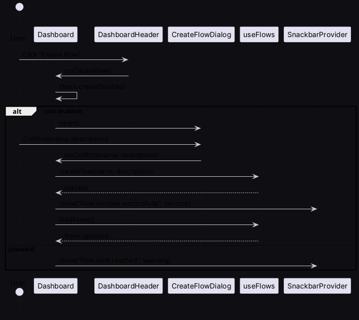

# FlowBuilder Dashboard — UI Architecture and Interaction Guide

This document describes the dashboard layout, component relationships, key flows, and includes PlantUML diagrams for both class and sequence views.

## Overall Layout

- __Structure__
  - __Left Sidebar (fixed 280px)__: header, user profile, usage analytics, navigation, and logout.
  - __Right Main Content (flex)__: header with tabs/actions, tab panels, and an overlay dialog for creating flows.
- __Background__
  - Light: `linear-gradient(135deg, #667eea 0%, #764ba2 100%)`
  - Dark: `linear-gradient(135deg, #1a1a2e 0%, #16213e 50%, #0f3460 100%)` with subtle radial accents.
- __Theme__
  - Dark-first. Cards use glassy overlays (semi‑transparent with blur), white text, and accent colors from the theme: primary (indigo/purple), success (green), warning (orange), error (red).
- __Responsiveness__
  - Grid layout adapts: 1 column (mobile) → 2 (tablet) → 3–4 (desktop). Main content scrolls with `overflow: auto`.

Key files:
- `frontend/src/pages/Dashboard.tsx`
- `frontend/src/components/dashboard/Sidebar.tsx`
- `frontend/src/components/dashboard/DashboardHeader.tsx`
- `frontend/src/components/dashboard/DashboardContent.tsx`
- `frontend/src/components/dashboard/FlowList.tsx`
- `frontend/src/components/dashboard/ExampleFlowList.tsx`
- `frontend/src/components/dashboard/TutorialList.tsx`
- `frontend/src/components/dashboard/UsageAnalytics.tsx`
- `frontend/src/components/dashboard/CreateFlowDialog.tsx`
- `frontend/src/components/dashboard/TabPanel.tsx`
- `frontend/src/components/SnackbarProvider.tsx`
- Hooks/Stores: `frontend/src/hooks/useFlows.ts`, `frontend/src/hooks/useSnackbar.ts`, `frontend/src/store/snackbarStore.ts`
- Config: `frontend/src/constants.ts`

---

## Sidebar (Left Panel)

- __Header__
  - Icon + "FlowBuilder" label; uses primary color accents and light glass effect.
- __User Profile__
  - Rounded card with avatar (gradient background, initial letter fallback), user name (bold), plan name in subdued text.
- __Usage Analytics__ (`UsageAnalytics.tsx`)
  - Title with `AnalyticsIcon`.
  - Three stacked items: Flows, API Calls, Storage.
    - Labels left; values right (e.g., `5/50`, `2.4K/10K`, `1.2GB/5GB`).
    - 8px rounded `LinearProgress` bars with gradients:
      - Flows: purple gradient
      - API: green gradient
      - Storage: orange gradient
    - Smart formatting for thousands (`K`) and units (`GB`).
  - Defaults from `constants.ts` when data missing.
- __Navigation Menu__
  - Items: Dashboard (highlighted) and Settings (hover states).
- __Logout Button__
  - Full-width outlined button with `LogoutIcon`. Red accent hover.

---

## Main Content (Right Panel)

- __Header__ (`DashboardHeader.tsx`)
  - Tabs: "Web Flow Library" and "Tutorials" with gradient indicator.
  - Actions: Refresh icon button; Create Flow button (gradient background) honoring plan limits.
- __Tabbed Panels__ (`TabPanel.tsx`)
  - Index 0: `FlowList` and `ExampleFlowList`.
  - Index 1: `TutorialList`.
- __Create Flow Dialog__ (`CreateFlowDialog.tsx`)
  - Modal for name/description; confirm triggers flow creation.

---

## Connections Between Components (High-level)

- __`Dashboard.tsx`__ orchestrates everything:
  - Fetches data via `useFlows()` and `useDashboardSummary()`.
  - Holds UI state (active tab, dialog open/close) and handlers.
  - Passes analytics to `Sidebar` and interactions to `DashboardContent`.
- __`DashboardContent.tsx`__ composes the header, panels, and dialog.
- __`FlowList.tsx`__ renders flow cards and exposes callbacks: edit, delete, toggle.
- __`ExampleFlowList.tsx`__ and __`TutorialList.tsx`__ surface lightweight actions upward.
- __`SnackbarProvider.tsx`__ offers `useSnackbar()` to show global feedback.
- __`constants.ts`__ centralizes defaults (e.g., `DEFAULT_FLOWS_MAX`, `DEFAULT_API_CALLS`, `DEFAULT_STORAGE`).

Simple mental model:
- Dashboard = brain
- Sidebar = status and navigation
- Header = filters and actions
- Panels = content
- Dialog = create action

---

## Important Functions and Where They Live

- __Flow loading/CRUD__ (`hooks/useFlows.ts`)
  - `loadFlows()`: fetches flows list.
  - `createFlow(name, description)`: creates a flow.
  - `deleteFlow(flowId)`: deletes a flow.
  - `toggleFlow(flowId, isActive)`: activate/deactivate a flow.
- __Dashboard handlers__ (`pages/Dashboard.tsx`)
  - `handleCreateFlow()`: enforces plan limit and opens dialog.
  - `handleConfirmCreateFlow(name, description)`: calls `createFlow` and shows snackbars.
  - `handleEditFlow(flowId)`: navigates to flow builder.
  - `handleStartTutorial(tutorial)`: placeholder snackbars for tutorials.
  - `handleLoadFlows() / loadFlows()`: wraps `useFlows.loadFlows` with snackbar on error.
- __Snackbar__
  - `useSnackbar()` from `components/SnackbarProvider.tsx` to show success/info/warn/error.
- __Usage analytics formatting__ (`components/dashboard/UsageAnalytics.tsx`)
  - `formatValue(current, max, unit?)`: converts to `K` and appends units.

---

## PlantUML — Class Diagram

```plantuml
@startuml
skinparam backgroundColor #0f0f13
skinparam classBackgroundColor #1a1a25
skinparam classBorderColor #999999
skinparam ArrowColor #cccccc
skinparam defaultFontName Inter

class Dashboard {
  - activeTab: number
  - createDialogOpen: boolean
  + handleCreateFlow()
  + handleConfirmCreateFlow(name, description)
  + handleEditFlow(flowId)
}

class Sidebar {
  + props: { user, flowCount, planName, analytics, onLogout }
}

class DashboardContent {
  + props: { flows, loading, error, ... }
}

class DashboardHeader {
  + props: { activeTab, onTabChange, loading, onRefresh, onCreateFlow }
}

class FlowList {
  + props: { flows, loading, onEdit, onDelete, onToggle }
}

class ExampleFlowList {
  + props: { onUseTemplate }
}

class TutorialList {
  + props: { onStartTutorial }
}

class CreateFlowDialog {
  + props: { open, onClose, onConfirm, flowCount }
}

class TabPanel { + props: { value, index } }
class UsageAnalytics { 
    + props: { flowCount, analytics } }
class SnackbarProvider { + useSnackbar(): fn }
class useFlows {
  + flows: Flow[]
  + loadFlows(): Promise<void>
  + createFlow(name, desc): Promise<void>
  + deleteFlow(id): Promise<void>
  + toggleFlow(id, active): Promise<void>
}
class constants {
  + DEFAULT_FLOWS_MAX
  + DEFAULT_API_CALLS
  + DEFAULT_STORAGE
}

Dashboard --> Sidebar
Dashboard --> DashboardContent
DashboardContent --> DashboardHeader
DashboardContent --> TabPanel
DashboardContent --> FlowList
DashboardContent --> ExampleFlowList
DashboardContent --> TutorialList
DashboardContent --> CreateFlowDialog
Sidebar --> UsageAnalytics
Dashboard ..> useFlows
Dashboard ..> SnackbarProvider
Dashboard ..> constants
UsageAnalytics ..> constants
@enduml
```

---

## PlantUML — Sequence Diagram (Create Flow)



---

## Constants and Defaults

Defined in `frontend/src/constants.ts`:
- `DEFAULT_FLOWS_MAX = 50`
- `DEFAULT_API_CALLS = { current: 0, max: 10000 }`
- `DEFAULT_STORAGE = { usedGb: 0, maxGb: 5 }`
- `DEFAULT_API_CALLS_CURRENT = 2400` (UsageAnalytics fallback)
- `DEFAULT_STORAGE_USED_GB = 1.2` (UsageAnalytics fallback)

These should be imported where defaults are needed (e.g., `Dashboard.tsx`, `UsageAnalytics.tsx`).

---

## Styling Notes

- Cards use subtle glassmorphism:
  - Semi-transparent backgrounds, `backdrop-filter: blur(...)`, soft borders, and elevated hover shadows.
- Interactions:
  - Buttons and tabs have gradient backgrounds/indicators and smooth scale/translate hover effects.
- Accessibility:
  - Maintain contrast with white text and ensure focus-visible states are clear.

---

## Extending the Dashboard

- Add more analytics items by extending `UsageAnalytics` data source and `constants.ts`.
- Add new tabs by updating `DashboardHeader` and rendering additional `TabPanel` indices.
- Centralize new magic numbers in `constants.ts`.

---

## File Map Reference

- `CreateFlowDialog.tsx`: dialog component to capture flow metadata.
- `DashboardContent.tsx`: assembles header, panels, and dialog.
- `DashboardHeader.tsx`: tabs and actions (refresh/create).
- `ExampleFlowList.tsx`: example templates list.
- `FlowList.tsx`: flow cards with edit/delete/toggle.
- `Sidebar.tsx`: left rail with profile, analytics, nav, logout.
- `TabPanel.tsx`: small helper for tab content.
- `TutorialList.tsx`: tutorials library.
- `UsageAnalytics.tsx`: progress bars and value formatting.
- `SnackbarProvider.tsx`: global toast system and hook.
- `useFlows.ts`: flows CRUD hook.
- `useSnackbar.ts`: convenience hook for snackbar access.
- `snackbarStore.ts`: store backing the snackbar provider.
- `constants.ts`: centralized defaults.
