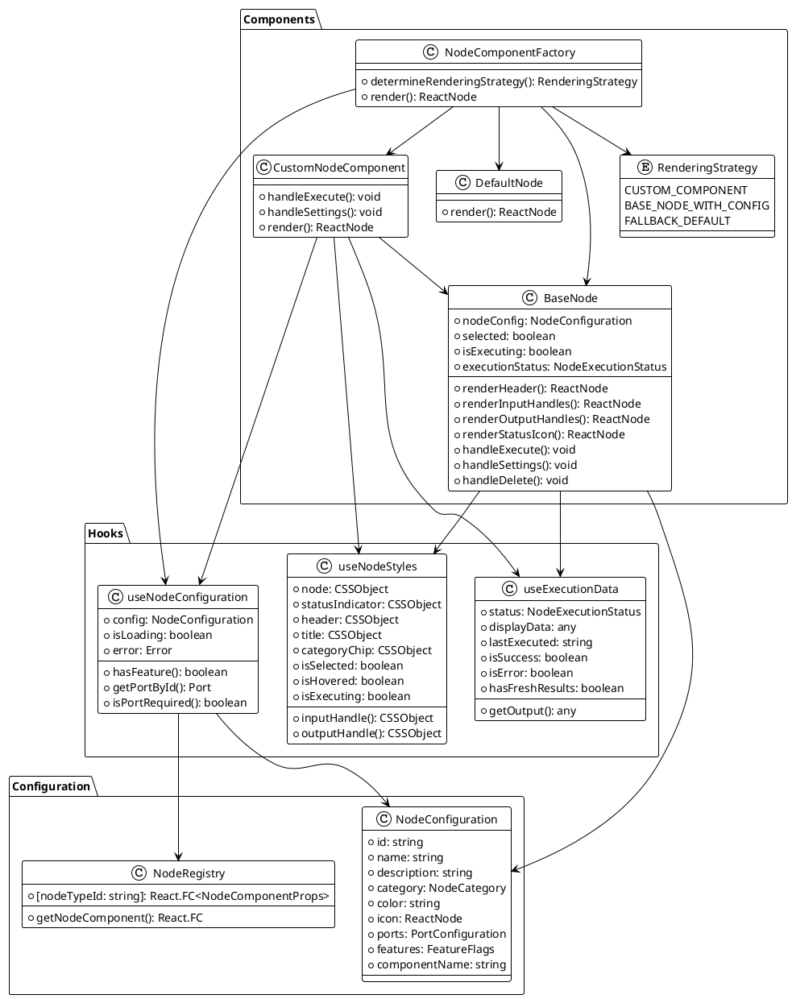
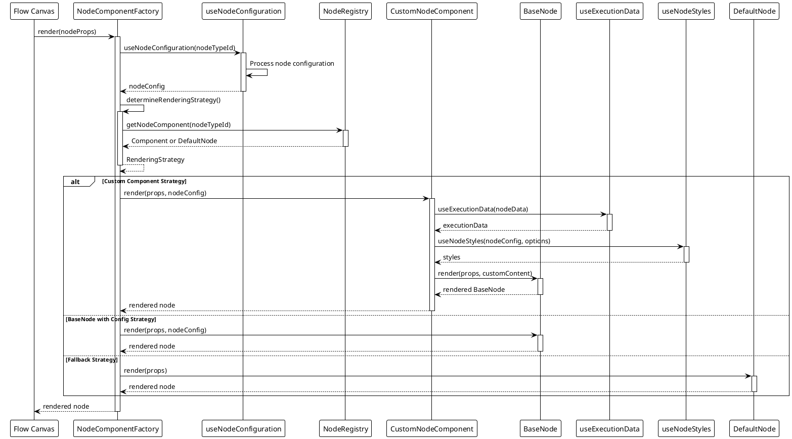
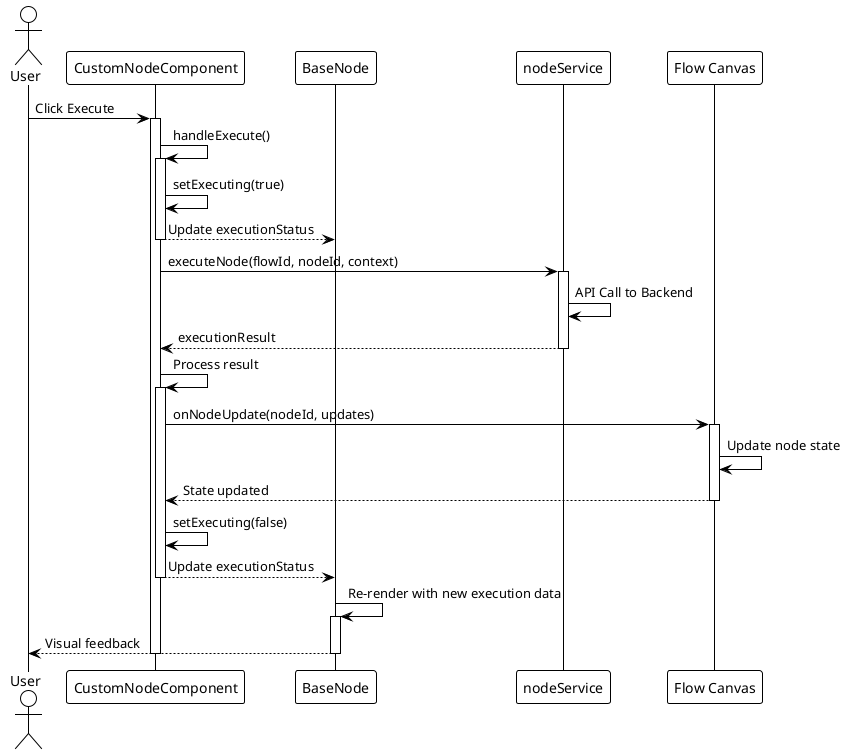

# Node Component Architecture Documentation

## Table of Contents
1. [Overview](#overview)
2. [Core Components](#core-components)
3. [Component Hierarchy](#component-hierarchy)
4. [Hook System](#hook-system)
5. [Node Rendering Process](#node-rendering-process)
6. [PlantUML Diagrams](#plantuml-diagrams)
7. [Creating New Nodes](#creating-new-nodes)

## Overview

The Node Component Architecture is a sophisticated system for rendering, configuring, and managing nodes in the Social Media Flow Builder. It provides a consistent, extensible framework for creating and customizing node components with shared functionality.

### Key Features
- **Component-Based Architecture**: Modular design with clear separation of concerns
- **Hook-Based State Management**: Custom React hooks for configuration, execution data, and styling
- **Dynamic Component Factory**: Smart routing of node types to appropriate components
- **Consistent UI/UX**: Shared BaseNode component for unified appearance and behavior
- **Extensible Registry**: Easy registration of new node types and components

## Core Components

### 1. BaseNode
```typescript
// Location: src/components/nodes/BaseNode.tsx
export interface BaseNodeProps extends NodeComponentProps {
  nodeTypeId?: string;
  nodeConfig?: NodeConfiguration;
  children?: React.ReactNode;
  customContent?: React.ReactNode;
  onExecute?: () => Promise<void> | void;
  onSettings?: () => void;
  executionStatus?: NodeExecutionStatus;
  validationState?: 'error' | 'success' | 'none';
  isExecuting?: boolean;
  hideDefaultContent?: boolean;
  customHeader?: React.ReactNode;
  customFooter?: React.ReactNode;
  icon?: React.ReactNode;
}
```

**Responsibilities:**
- Core shared React component for all nodes
- Renders input/output handles, node header, and content
- Provides execution and settings buttons
- Displays status indicators and execution results
- Supports customization via props

### 2. NodeComponentFactory
```typescript
// Location: src/components/nodes/NodeComponentFactory.tsx
enum RenderingStrategy {
  CUSTOM_COMPONENT = 'custom_component',
  BASE_NODE_WITH_CONFIG = 'base_node_with_config',
  FALLBACK_DEFAULT = 'fallback_default'
}
```

**Responsibilities:**
- Smart routing based on node configuration and available components
- Automatic configuration injection
- Performance optimization with memoization
- Comprehensive error handling and fallbacks
- Loading state management

### 3. Registry
```typescript
// Location: src/components/nodes/registry.tsx
export const nodeComponentRegistry: Record<string, React.FC<NodeComponentProps>> = {
  'chat_input': ChatInputNode,
  'voice_input': VoiceInputNode,
  'telegram_input': TelegramInputNode,
  'simple-openai-chat': OpenAIChatNode,
  'simple-deepseek-chat': DeepSeekChatNode,
  'transcription': TranscriptionNode,
  'send_telegram_message': TelegramMessageActionNode,
};
```

**Responsibilities:**
- Maps node type IDs to React components
- Provides DefaultNode fallback component
- Exports helper to get appropriate component for a node type

### 4. Custom Node Components
```typescript
// Example: src/components/nodes/node-types/ChatInputNode.tsx
export const ChatInputNode: React.FC<NodeComponentProps> = (props) => {
  // Node-specific state and logic
  
  return (
    <BaseNode
      {...props}
      nodeConfig={nodeConfig}
      onExecute={handleExecute}
      customContent={customContent}
    />
  );
};
```

**Responsibilities:**
- Implement node-specific UI and behavior
- Leverage BaseNode for consistent appearance
- Handle node-specific execution logic
- Manage node-specific state and settings

## Component Hierarchy

```
NodeComponentFactory
├── CustomNodeComponent (e.g., ChatInputNode)
│   └── BaseNode
│       ├── Header
│       │   ├── Icon
│       │   ├── Title
│       │   └── Action Buttons
│       ├── CategoryChip
│       ├── CustomContent
│       ├── DefaultContent
│       │   ├── Description
│       │   └── ExecutionData
│       ├── InputHandles
│       └── OutputHandles
├── BaseNode (with config)
└── DefaultNode (fallback)
```

## Hook System

### 1. useNodeConfiguration
```typescript
// Location: src/components/nodes/hooks/useNodeConfiguration.ts
export const useNodeConfiguration = (nodeTypeId: string | undefined) => {
  // Returns node configuration, loading state, and error
};
```

**Responsibilities:**
- Provides centralized access to node metadata
- Merges backend and frontend registry data
- Handles missing nodeTypeId and fallbacks
- Returns configuration, ports, features, and validation helpers

### 2. useExecutionData
```typescript
// Location: src/components/nodes/hooks/useExecutionData.ts
export const useExecutionData = (nodeData: NodeDataWithHandlers) => {
  // Returns execution data, status, and display helpers
};
```

**Responsibilities:**
- Extracts and formats execution results from node data
- Prioritizes fresh execution outputs over cached instance data
- Supports multiple output types (message_data, ai_response, raw)
- Provides utility functions and execution status flags

### 3. useNodeStyles
```typescript
// Location: src/components/nodes/hooks/useNodeStyles.ts
export const useNodeStyles = (
  config: NodeConfiguration,
  options: UseNodeStylesOptions = {}
) => {
  // Returns style objects for node components
};
```

**Responsibilities:**
- Generates dynamic CSS styles for nodes
- Handles state-based styling (selected, hover, execution)
- Centralizes theming and animations
- Provides consistent handle and status indicator styling

## Node Rendering Process

1. **Component Selection**:
   - NodeComponentFactory receives node props
   - Determines rendering strategy based on node type and available components
   - Selects appropriate component (custom, BaseNode, or DefaultNode)

2. **Configuration Injection**:
   - useNodeConfiguration hook fetches and processes node configuration
   - Configuration is injected into selected component

3. **State Management**:
   - Node component manages internal state (execution, settings, etc.)
   - useExecutionData hook provides execution results and status
   - useNodeStyles hook generates dynamic styles based on state

4. **Rendering**:
   - BaseNode renders shared UI elements (handles, header, buttons)
   - Custom content is rendered within BaseNode
   - Execution results are displayed based on node type

5. **Event Handling**:
   - Node actions (execute, settings, delete) are handled by callbacks
   - Execution state is updated and reflected in UI
   - Node state is updated via callbacks to parent components

## PlantUML Diagrams

### Class Diagram



### Sequence Diagram - Node Rendering



### Sequence Diagram - Node Execution



## Creating New Nodes

### Step-by-Step Guide

#### 1. Create the Node Component

```typescript
// src/components/nodes/node-types/YourCustomNode.tsx
import React, { useState } from 'react';
import { NodeComponentProps } from '../registry';
import { BaseNode } from '../BaseNode';
import { useNodeConfiguration, useExecutionData } from '../hooks';

export const YourCustomNode: React.FC<NodeComponentProps> = (props) => {
  const { data, id } = props;
  const [executing, setExecuting] = useState(false);
  
  // Get node data with handlers
  const nodeData = data as NodeDataWithHandlers;
  const { nodeType } = nodeData;
  
  // Use our modular hooks
  const nodeConfig = useNodeConfiguration(nodeType?.id || 'your_custom_node');
  const executionData = useExecutionData(nodeData);
  
  // Handle execution
  const handleExecute = async () => {
    setExecuting(true);
    try {
      // Your execution logic here
      // Example: await nodeService.execution.executeNode(flowId, id, {});
    } catch (error) {
      console.error('Execution failed:', error);
    } finally {
      setExecuting(false);
    }
  };
  
  // Custom content for your node
  const customContent = (
    <>
      {/* Your custom UI elements here */}
    </>
  );
  
  return (
    <BaseNode
      {...props}
      nodeConfig={nodeConfig}
      onExecute={handleExecute}
      customContent={customContent}
      executionStatus={executing ? NodeExecutionStatus.RUNNING : undefined}
    />
  );
};
```

#### 2. Register the Node Component

```typescript
// src/components/nodes/registry.tsx
import { YourCustomNode } from './node-types/YourCustomNode';

export const nodeComponentRegistry: Record<string, React.FC<NodeComponentProps>> = {
  // Existing nodes
  'your_custom_node': YourCustomNode,
};
```

#### 3. Add to Node Registry (Frontend)

```typescript
// src/config/nodeRegistry.ts
export const NODE_REGISTRY: Record<string, NodeRegistryEntry> = {
  // Existing nodes
  'your_custom_node': {
    category: NodeCategory.PROCESSOR,
    subcategory: 'Your Subcategory',
    componentName: 'YourCustomNode',
    features: {
      hasSettings: true,
      hasExecution: true,
      hasCustomUI: true,
      hasStatusIndicator: true
    }
  }
};
```

#### 4. Add Icon (Optional)

```typescript
// src/config/nodeIcons.ts
import YourCustomIcon from '../components/icons/YourCustomIcon';

export const NODE_ICONS: Record<string, NodeIconComponent> = {
  // Existing icons
  'your_custom_node': YourCustomIcon,
};
```

#### 5. Export the Node Component

```typescript
// src/components/nodes/node-types/index.ts
export * from './YourCustomNode';
```

### Example: ChatInputNode

The ChatInputNode is a good example of a custom node component that follows best practices:

1. **Uses BaseNode**: Leverages the shared BaseNode component for consistent UI
2. **Implements Hooks**: Uses useNodeConfiguration and useExecutionData
3. **Manages State**: Handles local state for dialog, input text, and execution
4. **Custom UI**: Provides custom content with dialog and execution results display
5. **Error Handling**: Properly handles execution errors and provides feedback

Key implementation details:
- Dialog for user input
- Execution through nodeService API
- State updates via onNodeUpdate callback
- Visual feedback for execution status
- Proper error handling

By following this pattern, you can create consistent, maintainable node components that integrate seamlessly with the flow builder system.
