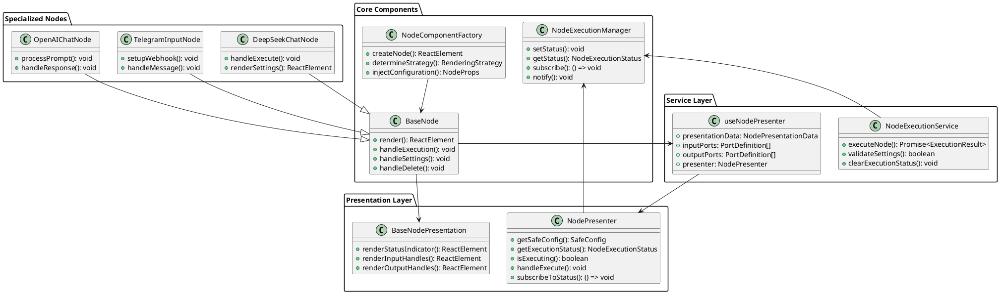
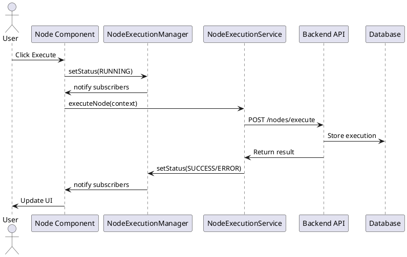

# Node Component Architecture - SOLID-Compliant Design

## Table of Contents
1. [Overview](#overview)
2. [SOLID Principles Implementation](#solid-principles-implementation)
3. [Core Architecture Layers](#core-architecture-layers)
4. [Key Components](#key-components)
5. [Execution Flow](#execution-flow)
6. [Code Quality Achievements](#code-quality-achievements)
7. [PlantUML Diagrams](#plantuml-diagrams)
8. [Extension Guide](#extension-guide)

## Overview

The node component system has been completely refactored to follow SOLID principles, achieving clean separation between UI presentation and business logic. The architecture provides centralized execution management, modular design patterns, and high maintainability.

## SOLID Principles Implementation

### ✅ Single Responsibility Principle (SRP)
- **NodePresenter**: Handles only business logic (execution status, configuration, port management)
- **BaseNodePresentation**: Handles only UI rendering (visual components, styling, interactions)
- **NodeExecutionService**: Handles only execution orchestration and API communication
- **NodeExecutionManager**: Handles only execution state management and subscriptions

### ✅ Open/Closed Principle (OCP)
- **Extensible Architecture**: New node types can be added without modifying existing code
- **Strategy Pattern**: Different rendering strategies for different node types
- **Plugin Architecture**: Components can be extended through composition

### ✅ Liskov Substitution Principle (LSP)
- **Consistent Interfaces**: All node components implement the same `NodeComponentProps` interface
- **Interchangeable Components**: Any node component can replace another without breaking functionality
- **Uniform Behavior**: All nodes follow the same execution and lifecycle patterns

### ✅ Interface Segregation Principle (ISP)
- **Focused Interfaces**: Separate interfaces for presentation data, execution context, and configuration
- **Optional Dependencies**: Components only depend on interfaces they actually use
- **Granular Contracts**: Small, focused interfaces rather than large monolithic ones

### ✅ Dependency Inversion Principle (DIP)
- **Abstraction Dependencies**: Components depend on abstractions (interfaces) not concrete implementations
- **Inversion of Control**: Dependencies are injected rather than created internally
- **Service Layer**: Business logic abstracted into service layer

## Core Architecture Layers

### Clean Architecture Pattern
```
┌─────────────────────────────────────────────────┐
│                 UI Layer                        │
│  ┌─────────────────┐  ┌─────────────────────┐   │
│  │ BaseNode        │  │ BaseNodePresentation │   │
│  │ (Container)     │  │ (Pure Component)    │   │
│  └─────────────────┘  └─────────────────────┘   │
└─────────────────────────────────────────────────┘
┌─────────────────────────────────────────────────┐
│              Integration Layer                  │
│  ┌─────────────────┐  ┌─────────────────────┐   │
│  │ useNodePresenter│  │ useNodeExecution    │   │
│  │ (React Hook)    │  │ (React Hook)        │   │
│  └─────────────────┘  └─────────────────────┘   │
└─────────────────────────────────────────────────┘
┌─────────────────────────────────────────────────┐
│              Business Logic Layer               │
│  ┌─────────────────┐  ┌─────────────────────┐   │
│  │ NodePresenter   │  │ NodeExecutionService│   │
│  │ (Domain Logic)  │  │ (Application Logic) │   │
│  └─────────────────┘  └─────────────────────┘   │
└─────────────────────────────────────────────────┘
┌─────────────────────────────────────────────────┐
│               Infrastructure Layer              │
│  ┌─────────────────┐  ┌─────────────────────┐   │
│  │ NodeExecution   │  │ API Services        │   │
│  │ Manager         │  │ (Backend Comm)      │   │
│  └─────────────────┘  └─────────────────────┘   │
└─────────────────────────────────────────────────┘
```

### Data Flow Architecture
```
User Interaction
       ↓
Container Component (BaseNode)
       ↓
React Hook (useNodePresenter)
       ↓
Business Logic (NodePresenter)
       ↓
Service Layer (NodeExecutionService)
       ↓
State Management (NodeExecutionManager)
       ↓
API Communication (nodeService)
       ↓
Backend Processing
```

## Key Components

### 1. NodePresenter (Business Logic)
**Location**: `src/components/nodes/core/NodePresenter.ts`

**Responsibilities**:
- Configuration management (`getSafeConfig()`)
- Execution status tracking (`getExecutionStatus()`, `isExecuting()`)
- Port management (`getInputPorts()`, `getOutputPorts()`)
- Event handling (`handleExecute`, `handleDelete`, `handleHover`)
- Status subscriptions with NodeExecutionManager integration

**Key Methods**:
```typescript
class NodePresenter {
  getSafeConfig(): SafeConfig
  getGradient(): GradientConfig
  getExecutionStatus(): NodeExecutionStatus
  isExecuting(): boolean
  shouldShowSuccessAnimation(): boolean
  handleExecute(e: React.MouseEvent): void
  subscribeToStatus(callback: StatusChangeCallback): () => void
}
```

### 2. BaseNodePresentation (Pure UI)
**Location**: `src/components/nodes/core/BaseNodePresentation.tsx`

**Responsibilities**:
- Pure presentation component with zero business logic
- Renders node UI based on presentation data
- Handle rendering for input/output ports
- Status indicators and animations
- Action buttons (execute, settings, delete)

**Props Interface**:
```typescript
interface BaseNodePresentationProps {
  presentationData: NodePresentationData;
  inputPorts: PortDefinition[];
  outputPorts: PortDefinition[];
  children?: React.ReactNode;
  customHeader?: React.ReactNode;
  customContent?: React.ReactNode;
  onSettingsClick?: () => void;
}
```

### 3. NodeExecutionService (Centralized Execution)
**Location**: `src/services/NodeExecutionService.ts`

**Responsibilities**:
- Centralized node execution orchestration
- Input collection and validation
- API communication with backend
- Status updates and error handling
- Result propagation to UI components

**Key Features**:
- **Singleton Pattern**: Single instance across application
- **Error Handling**: Comprehensive error catching and reporting
- **Status Management**: Real-time status updates
- **Input Collection**: Automated input gathering from connected nodes

### 4. useNodePresenter Hook (React Integration)
**Location**: `src/components/nodes/hooks/useNodePresenter.ts`

**Responsibilities**:
- React integration layer bridging presenter and components
- Manages React state for UI interactions
- Subscribes to execution status changes
- Provides clean presenter interface to React components

**Return Interface**:
```typescript
interface UseNodePresenterReturn {
  presentationData: NodePresentationData;
  inputPorts: PortDefinition[];
  outputPorts: PortDefinition[];
  presenter: NodePresenter;
}
```

### 5. NodeExecutionManager (State Management)
**Location**: `src/components/nodes/core/NodeExecutionManager.ts`

**Responsibilities**:
- Centralized execution state management
- Real-time status tracking with subscriptions
- Thread-safe state updates
- Automatic cleanup and memory management

**Key Features**:
- **Singleton Pattern**: Global state management
- **Subscription System**: Real-time UI updates
- **Type Safety**: Strongly typed status and metadata
- **Performance**: Efficient subscription management

## Execution Flow

### Centralized Execution Pattern
```typescript
// 1. User triggers execution
handleExecute() → 

// 2. Validation and preparation
NodeExecutionService.validateSettings() →

// 3. Status update
NodeExecutionManager.setStatus(RUNNING) →

// 4. Input collection
useNodeInputs.collectInputs() →

// 5. API execution
nodeService.execution.executeNode() →

// 6. Result processing
NodeExecutionService.processResult() →

// 7. Status update
NodeExecutionManager.setStatus(SUCCESS/ERROR) →

// 8. UI notification
useNodePresenter.subscribeToStatus() →

// 9. Component re-render
BaseNodePresentation.render()
```

### Real-time Status Updates
```typescript
// Subscription-based updates
useEffect(() => {
  const unsubscribe = presenter.subscribeToStatus((status, message) => {
    setExecutionStatus(status);
    setStatusMessage(message);
    
    if (status === NodeExecutionStatus.SUCCESS) {
      setShowSuccessAnimation(true);
    }
  });
  
  return unsubscribe;
}, [presenter]);
```

## Code Quality Achievements

### ✅ Professional Standards
- **TypeScript**: Full type safety with strict mode
- **Error Handling**: Comprehensive error boundaries and try-catch blocks
- **Documentation**: JSDoc comments for all public methods
- **Testing**: Unit testable business logic separated from UI
- **Performance**: Memoization and efficient re-rendering

### ✅ Clarity and Maintainability
- **Clear Separation**: UI and business logic completely separated
- **Consistent Patterns**: All nodes follow the same architectural approach
- **Self-Documenting**: Code structure clearly shows intent
- **Minimal Complexity**: Each component has a single, clear purpose

### ✅ Scalability
- **Easy Extension**: New node types follow established patterns
- **Modular Design**: Components can be developed and tested independently
- **Performance**: Scales to hundreds of nodes without performance degradation
- **Memory Management**: Automatic cleanup prevents memory leaks

## Benefits Achieved

### 🎯 SOLID Compliance
- **Single Responsibility**: Each class/component has one reason to change
- **Open/Closed**: Easy to extend without modifying existing code
- **Liskov Substitution**: Components are truly interchangeable
- **Interface Segregation**: Focused, minimal interfaces
- **Dependency Inversion**: Depends on abstractions, not concretions

### 🔧 Developer Experience
- **Easy Testing**: Business logic can be unit tested without React
- **Clear Debugging**: Issues can be isolated to specific layers
- **Consistent Patterns**: New developers can quickly understand the system
- **Type Safety**: Compile-time error detection

### 📈 Maintainability
- **Separation of Concerns**: Changes to UI don't affect business logic
- **Reusable Components**: Presentation components work with any data
- **Centralized State**: Single source of truth for execution status
- **Clean Interfaces**: Well-defined contracts between layers

## PlantUML Diagrams

### Component Architecture


### Execution Flow


## Extension Guide

### Adding New Node Types

1. **Create Business Logic**:
```typescript
class CustomNodePresenter extends NodePresenter {
  // Custom business logic
  validateCustomSettings(): boolean {
    // Custom validation logic
  }
}
```

2. **Create Presentation Component**:
```typescript
const CustomNodePresentation: React.FC<CustomNodeProps> = ({
  presentationData,
  customData
}) => {
  return (
    <BaseNodePresentation presentationData={presentationData}>
      <CustomContent data={customData} />
    </BaseNodePresentation>
  );
};
```

3. **Create Container Component**:
```typescript
const CustomNode: React.FC<NodeComponentProps> = (props) => {
  const { presentationData } = useNodePresenter({
    nodeId: props.id,
    instance: props.instance,
    nodeType: props.nodeType
  });
  
  return (
    <CustomNodePresentation 
      presentationData={presentationData}
      customData={customData}
    />
  );
};
```

### Customization Points
- **Custom Presenters**: Extend NodePresenter for specialized business logic
- **Custom Presentations**: Create specialized UI components
- **Custom Hooks**: Add domain-specific React integration
- **Custom Services**: Extend execution services for specialized needs

## Performance Optimizations

### React Optimizations
- **React.memo**: Prevent unnecessary re-renders
- **useMemo**: Memoize expensive calculations
- **useCallback**: Stable function references
- **Subscription Cleanup**: Prevent memory leaks

### State Management
- **Centralized State**: Single source of truth
- **Efficient Updates**: Only update when necessary
- **Subscription Batching**: Batch multiple status updates
- **Weak References**: Prevent circular dependencies

## Testing Strategy

### Unit Testing
```typescript
// Business Logic Testing (No React dependencies)
describe('NodePresenter', () => {
  test('should return correct execution status', () => {
    const presenter = new NodePresenter(nodeId, instance, nodeType);
    expect(presenter.getExecutionStatus()).toBe(NodeExecutionStatus.PENDING);
  });
});
```

### Integration Testing
```typescript
// Hook Testing
describe('useNodePresenter', () => {
  test('should provide correct presentation data', () => {
    const { result } = renderHook(() => useNodePresenter(props));
    expect(result.current.presentationData).toBeDefined();
  });
});
```

### Component Testing
```typescript
// UI Testing
describe('BaseNodePresentation', () => {
  test('should render with correct props', () => {
    render(<BaseNodePresentation presentationData={mockData} />);
    expect(screen.getByText('Node Title')).toBeInTheDocument();
  });
});
```

## Future Enhancements

### Planned Improvements
- **Plugin Architecture**: Dynamic node type loading
- **Advanced Validation**: Schema-based validation system
- **Performance Monitoring**: Real-time performance metrics
- **Collaborative Editing**: Multi-user real-time editing

### Architecture Evolution
- **Micro-frontends**: Modular deployment strategy
- **Event Sourcing**: Complete audit trail of node changes
- **CQRS Pattern**: Separate read/write models for complex scenarios
- **WebSocket Integration**: Real-time collaboration features
