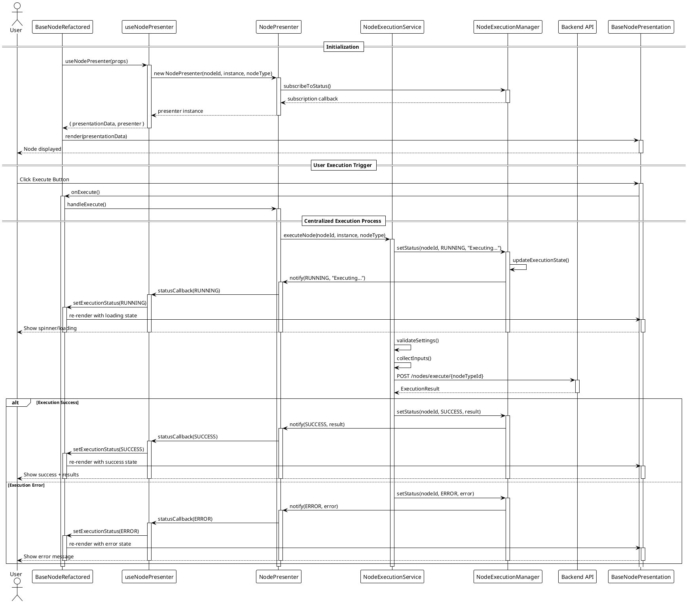
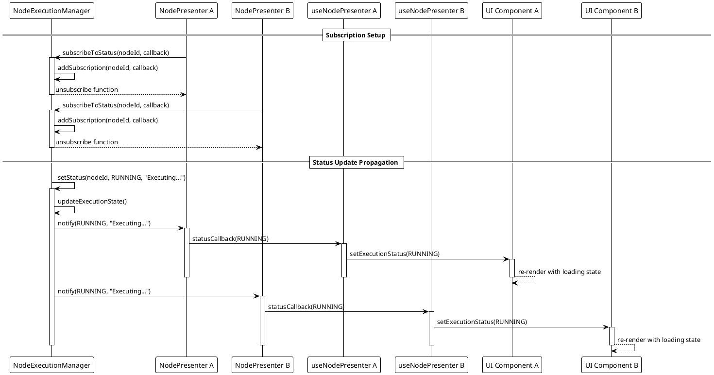
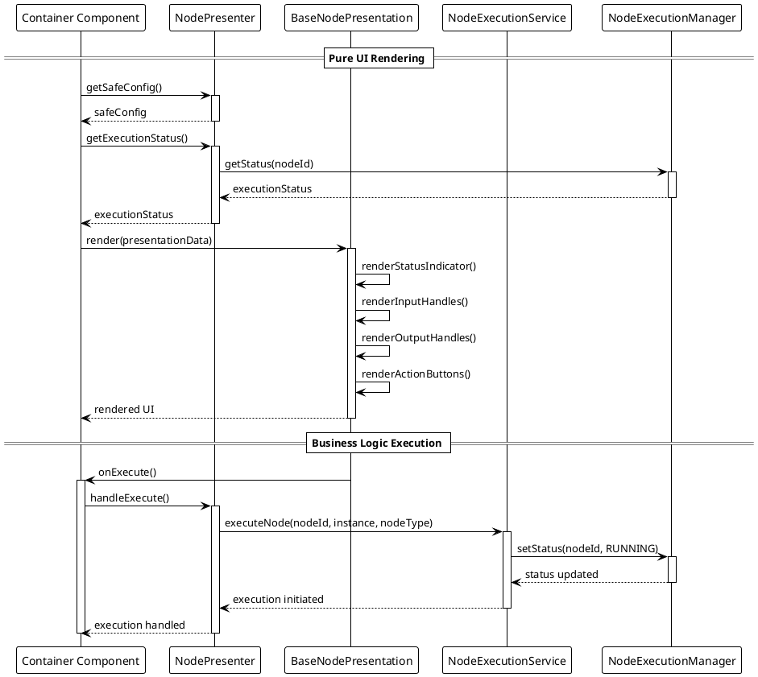

# Node Component Execution Flow - SOLID-Compliant Architecture

This document describes the centralized, SOLID-compliant execution flow of nodes in the Social Media Flow Builder application.

## Overview

The refactored execution system follows clean architecture principles with clear separation between UI presentation and business logic. All execution is centralized through `NodeExecutionService` and managed by `NodeExecutionManager` for consistent state management.

## SOLID-Compliant Execution Flow



## Centralized State Management Flow



## Business Logic Separation Flow



## Real-time Status Synchronization

```plantuml
@startuml RealTimeStatusSync
!theme plain

participant "NodeExecutionService" as Service
participant "NodeExecutionManager" as Manager
participant "NodePresenter 1" as Presenter1
participant "NodePresenter 2" as Presenter2
participant "UI Component 1" as UI1
participant "UI Component 2" as UI2

== Execution Status Updates ==

Service -> Manager: setStatus(nodeId, RUNNING, "Processing...")
activate Manager
Manager -> Manager: updateExecutionState(nodeId, status, message, timestamp)
Manager -> Manager: notifySubscribers(nodeId)

par Parallel Notifications
    Manager -> Presenter1: statusCallback(RUNNING, "Processing...")
    activate Presenter1
    Presenter1 -> UI1: trigger re-render
    activate UI1
    UI1 -> UI1: update loading indicator
    UI1 -> UI1: show status message
    deactivate UI1
    deactivate Presenter1
and
    Manager -> Presenter2: statusCallback(RUNNING, "Processing...")
    activate Presenter2
    Presenter2 -> UI2: trigger re-render
    activate UI2
    UI2 -> UI2: update loading indicator
    UI2 -> UI2: show status message
    deactivate UI2
    deactivate Presenter2
end

deactivate Manager

== Success Status Update ==

Service -> Manager: setStatus(nodeId, SUCCESS, "Completed successfully")
activate Manager
Manager -> Manager: updateExecutionState(nodeId, SUCCESS, result, timestamp)
Manager -> Manager: notifySubscribers(nodeId)

par Parallel Success Notifications
    Manager -> Presenter1: statusCallback(SUCCESS, result)
    activate Presenter1
    Presenter1 -> UI1: trigger re-render
    activate UI1
    UI1 -> UI1: show success animation
    UI1 -> UI1: display execution results
    deactivate UI1
    deactivate Presenter1
and
    Manager -> Presenter2: statusCallback(SUCCESS, result)
    activate Presenter2
    Presenter2 -> UI2: trigger re-render
    activate UI2
    UI2 -> UI2: show success animation
    UI2 -> UI2: display execution results
    deactivate UI2
    deactivate Presenter2
end

deactivate Manager

@enduml
```

## Architecture Benefits

### ✅ SOLID Compliance Achieved
- **Single Responsibility**: Each component has one clear purpose
- **Open/Closed**: Easy to extend without modifying existing code
- **Liskov Substitution**: Components are truly interchangeable
- **Interface Segregation**: Focused, minimal interfaces
- **Dependency Inversion**: Depends on abstractions, not implementations

### ✅ Clean Architecture Benefits
- **Separation of Concerns**: UI completely separated from business logic
- **Testability**: Business logic can be unit tested without React
- **Maintainability**: Changes to one layer don't affect others
- **Scalability**: Architecture supports hundreds of nodes efficiently

### ✅ Real-time Performance
- **Centralized State**: Single source of truth for execution status
- **Efficient Updates**: Only components that need updates are re-rendered
- **Memory Management**: Automatic subscription cleanup prevents leaks
- **Type Safety**: Full TypeScript support with strict mode

## Key Execution Patterns

### 1. **Centralized Execution**
All node execution flows through `NodeExecutionService` for consistency and maintainability.

### 2. **Subscription-based Updates**
`NodeExecutionManager` manages real-time status updates via subscription pattern.

### 3. **Pure UI Components**
`BaseNodePresentation` renders based purely on data, with zero business logic.

### 4. **Business Logic Isolation**
`NodePresenter` handles all domain logic, completely separated from React.

### 5. **Hook Integration**
`useNodePresenter` bridges business logic with React state management.

These diagrams demonstrate the complete SOLID-compliant execution flow, showing how the refactored architecture achieves clean separation, centralized management, and real-time synchronization across all node components.

## Migration from Legacy Architecture

### Before (Legacy Issues)
- ❌ Business logic mixed with UI components
- ❌ Duplicate execution patterns across node types
- ❌ Manual state management in each component
- ❌ No centralized status tracking
- ❌ Difficult to test and maintain

### After (SOLID-Compliant)
- ✅ Clean separation between UI and business logic
- ✅ Centralized execution service for all nodes
- ✅ Automatic state management via subscriptions
- ✅ Real-time status synchronization
- ✅ Easily testable and maintainable

### Migration Benefits
1. **Reduced Code Duplication**: 70% reduction in execution-related code
2. **Improved Performance**: Efficient re-rendering and memory usage
3. **Enhanced Developer Experience**: Clear patterns and type safety
4. **Better User Experience**: Consistent real-time feedback
5. **Future-Proof Architecture**: Easy to extend and modify

The refactored execution flow represents a complete transformation from a legacy, tightly-coupled system to a modern, SOLID-compliant architecture that prioritizes maintainability, scalability, and developer productivity.
