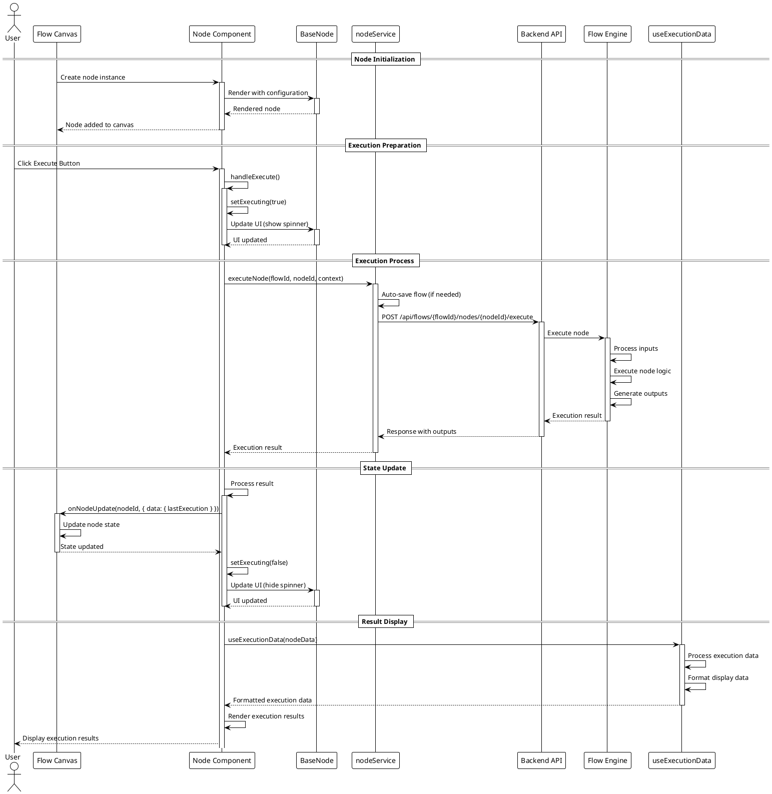
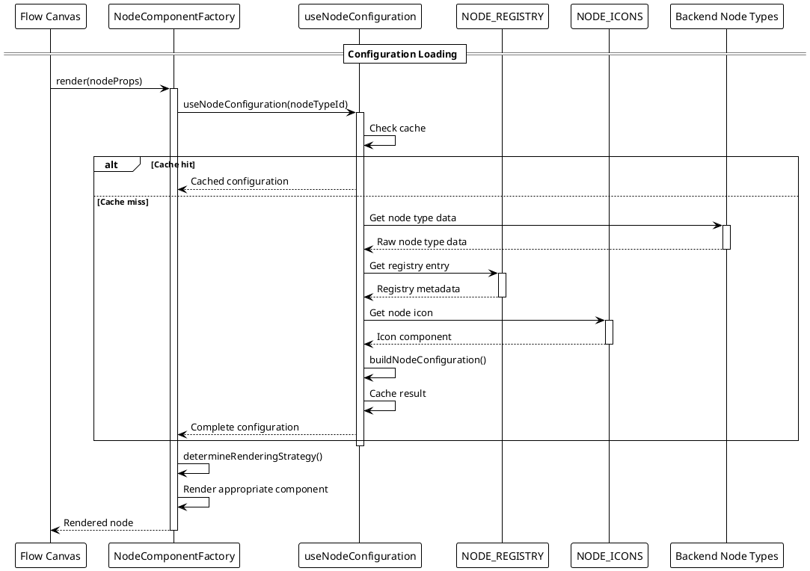
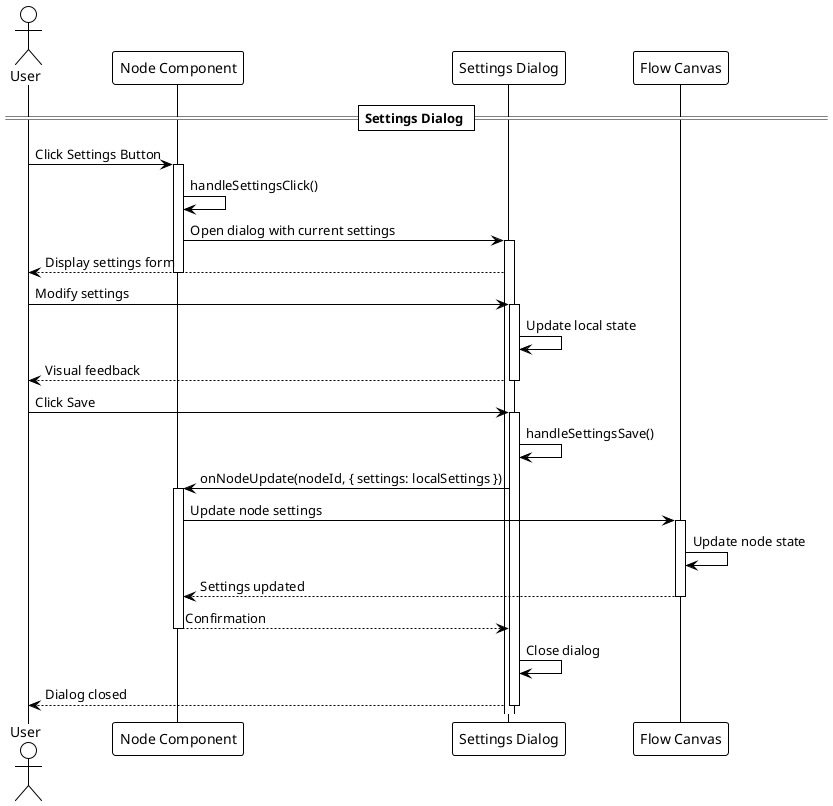
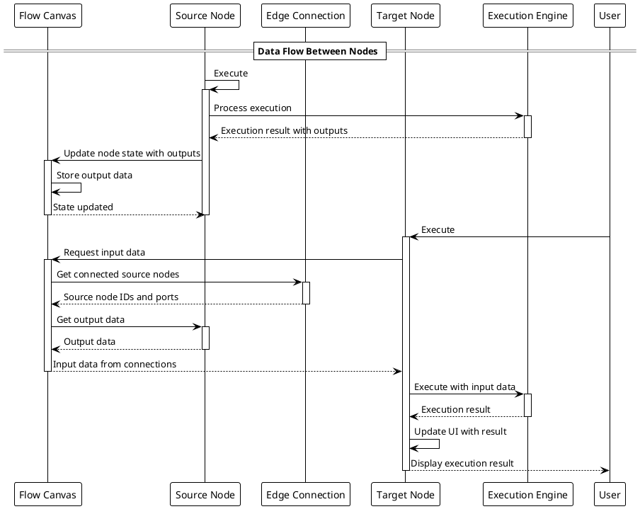

# Node Component Execution Flow

This document describes the execution flow of nodes in the Social Media Flow Builder application.

## Node Execution Sequence

## Node Configuration Flow

## Node Settings Flow

## Node Data Flow

These sequence diagrams illustrate the key flows in the node component architecture:

1. **Node Execution Flow**: Shows how a node is executed from user interaction through the backend and back to the UI
2. **Node Configuration Flow**: Demonstrates how node configuration is loaded and processed
3. **Node Settings Flow**: Illustrates the process of updating node settings
4. **Node Data Flow**: Shows how data flows between connected nodes during execution

Together, these diagrams provide a comprehensive view of the node component system's runtime behavior.
